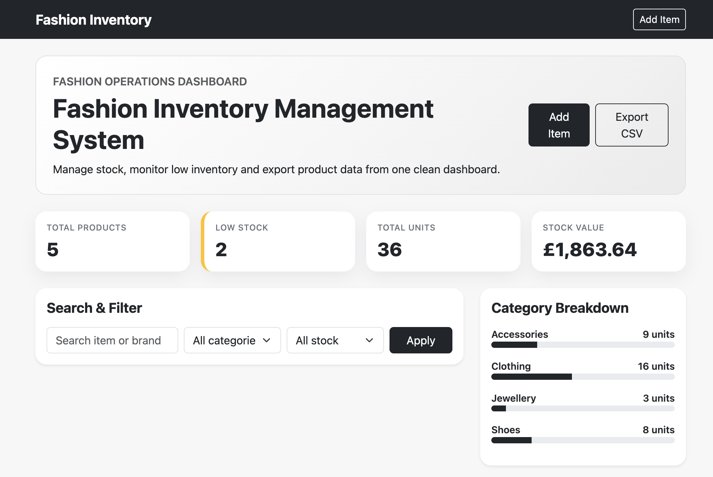
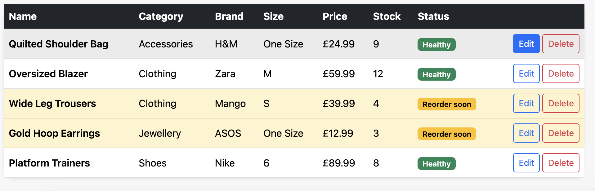
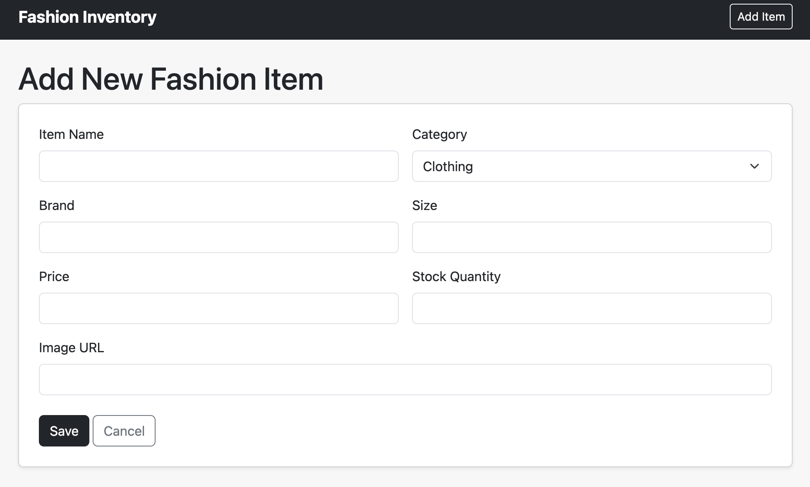
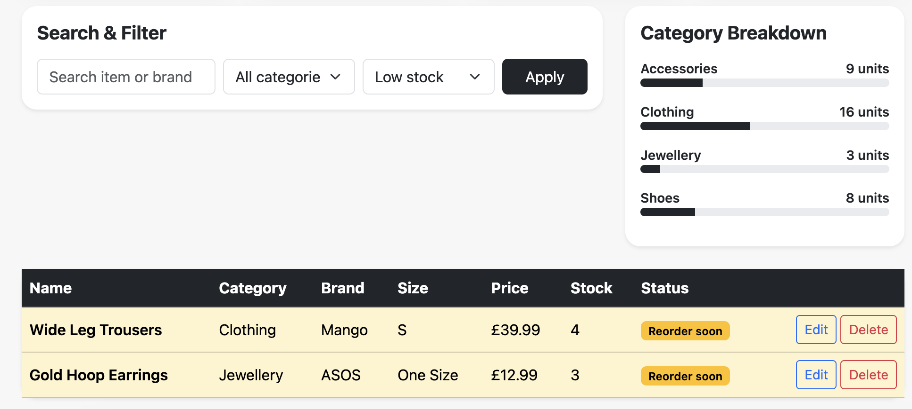

# Fashion Inventory Management System

A full-stack C# ASP.NET Core MVC application for managing fashion inventory, stock levels, category insights and product data exports.

## Project Overview

This project was built as a graduate software engineering portfolio project. It demonstrates MVC architecture, CRUD functionality, database integration, server-side logic, filtering, data export and a simple API layer.

## Features

- Add, edit and delete fashion inventory items
- Search inventory by product name or brand
- Filter by category and stock status
- Dashboard cards for total products, low-stock products, stock units and stock value
- Low-stock alerts for items with 5 or fewer units
- Category stock breakdown using progress bars
- CSV export for inventory reporting
- Seed data for quick demo/testing
- JSON API endpoints for inventory and dashboard summary data
- SQLite database using Entity Framework Core

## Technologies Used

- C#
- ASP.NET Core MVC
- Entity Framework Core
- SQLite
- HTML5
- CSS3
- Bootstrap
- REST-style API endpoints

## API Endpoints

```text
GET /api/inventory
GET /api/inventory/summary
```

## Skills Demonstrated

- Object-oriented programming
- MVC design pattern
- CRUD development
- Database integration
- Server-side validation
- LINQ queries
- Data filtering and reporting
- API development
- GitHub project documentation

## How To Run

1. Install the .NET 8 SDK
2. Open the project folder in Visual Studio or VS Code
3. Run the following commands:

```bash
dotnet restore
dotnet run
```

4. Open the local host URL shown in the terminal.

The SQLite database is created automatically and seeded with demo fashion inventory items.

## Application Screenshots

### Dashboard


### Inventory Table


### Add New Product


### Low Stock Filtering


## Future Improvements

- Add user login/authentication
- Add image upload support
- Add charts using Chart.js
- Add unit tests
- Deploy the application online
